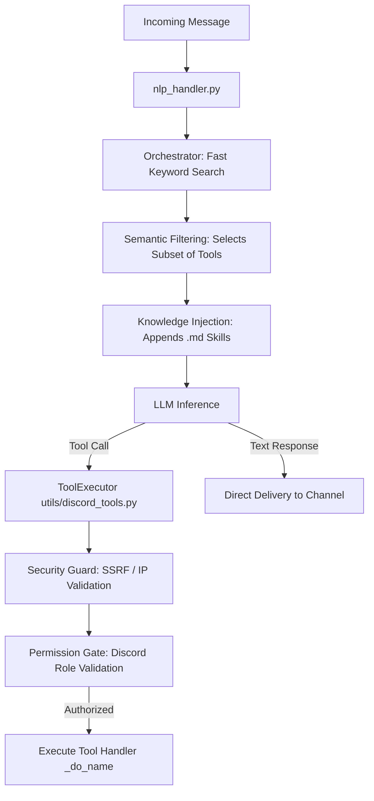

# Djinn — Discord Agentic Bot

Djinn is an autonomous, agentic Discord bot inspired by the AI concept from *Zenless Zone Zero*. It operates on a multi-model decision engine with native tool calling support, interacting with Discord servers through 137 registered capabilities.

The system utilizes a hybrid persistence model (SQLite in WAL mode for transactional data and ChromaDB for semantic memory), trust-first automated moderation (Goodfaith), perceptual multimedia content analysis (MediaGuard), internal administration APIs, and a structured narrative roleplay system (Kadath).

---

## 🛠️ Technology Stack

| Layer / Component | Technology | Purpose |
| :--- | :--- | :--- |
| **Core Language** | Python 3.11 | Primary execution runtime |
| **API Library** | discord.py >= 2.4.0 | Discord Gateway client and interface |
| **LLM Client** | google-genai >= 1.0.0 | Active SDK for Gemini and parametric Gemma models |
| **Alternative APIs** | openai >= 1.40.0 | SDK adapter for OpenRouter, DeepSeek v4, and NimLLM |
| **Relational Database**| aiosqlite >= 0.20.0 | Transactional data, credits, message buffering, and logs |
| **Vector Database** | chromadb >= 0.5.0 | Long-term semantic memory and vector retrieval |
| **Embedding Engine** | sentence-transformers >= 3.3.0 | Local vector generation using `all-MiniLM-L6-v2` |
| **MarianMT Translation**| sentencepiece + sacremoses | Local pipeline for the `curse_translator` cog |
| **Vision (MediaGuard)** | onnxruntime >= 1.16.0 | Image classification using MobileNetV3 |
| **Vector Indexing** | hnswlib >= 0.8.0 | Cosine-similarity approximate nearest neighbor search |
| **Graphics Engine** | cairosvg + Pillow | Dynamic SVG-to-PNG rendering and GIF assembly |
| **TTS (Voice)** | Piper | External offline text-to-speech engine |
| **Audio Protocol** | PyNaCl + mafic >= 2.11.0 | Voice channel protocol and Lavalink node client |
| **Ethical Moderation** | goodfaith >= 0.6.0 | External trust-first moderation framework |

---

## 🏗️ Repository Architecture

The project is structured modularly, cleanly separating presentation logic (cogs), core services (utils), and domain knowledge bases (skills):

```
djinn/
├── main.py                    # Bootstrap, logging setup, and cog registration
├── config.py                  # Dataclass loading configuration from environment variables
├── pyproject.toml             # Configuration for pytest, ruff, and coverage
├── requirements.txt           # Strict production dependency manifest
├── start.sh                   # Startup script for UNIX environments
│
├── cogs/                      # Domain logic and Discord event handlers
│   ├── nlp_handler.py         # Message entry point: routes input to LLM
│   ├── message_logger.py      # In-memory buffering + batch database flusher
│   ├── nexus_observer.py      # Dynamic identity tracking and alias histories (Nexus)
│   ├── automod_v3.py          # Goodfaith-backed active moderation
│   ├── media_guard/           # MobileNetV3 visual classification + perceptual hashing
│   ├── dream_quest.py         # Kadath narrative game state machine
│   ├── loan_shark.py          # Debt logic, dynamic interest rates, and credit scores
│   ├── treasury.py            # Guild-wide vault and banking (/banco)
│   ├── override_api.py        # Remote control HTTP API (Port 7700)
│   └── ... (38 cogs in total)
│
├── utils/                     # Core supporting services
│   ├── discord_tools.py       # ToolExecutor: Inner logic for the 137 capabilities
│   ├── tools/
│   │   ├── _declarations.py   # JSON schemas of tools exposed to the LLM
│   │   ├── _helpers.py        # Mathematical validators and date/duration parsers
│   │   └── _constants.py      # Security settings and JSON cleanup formatters
│   ├── orchestrator.py        # Keyword filtering and semantic intent routing
│   ├── llm_client.py          # Unified multi-provider LLM adapter with CircuitBreaker
│   ├── database.py            # SQLite schema, async database operations, and migrations
│   ├── security.py            # SSRF guard, command sandboxing, and permission checks
│   └── api_server.py          # Core local API on localhost:8080 (Logs, metrics, health)
│
├── skills/                    # Domain-specific Markdown files injected into system prompts
│   ├── deudas.md              # Loan enforcement behavior
│   ├── banco.md               # Bank deposit and pool mechanics
│   └── ... (16 knowledge files)
│
├── data/                      # Static configurations and perceptual hashes
│   ├── safe_domains.json      # Local cache of 10k safe domains for anti-phishing
│   └── banned_media.bin       # HNSW vector index of prohibited images
│
├── db/                        # SQLite database folder (gitignored)
├── logs/                      # Daily logs with integrated rotation (gitignored)
└── tests/                     # Full automated testing suite
```

---

## 🗃️ Database Schema (SQLite)

The database engine is configured for maximum concurrent performance in `utils/database.py` using:
- `PRAGMA journal_mode = WAL`
- `PRAGMA synchronous = NORMAL`
- `PRAGMA busy_timeout = 5000`

### Main Tables

#### 1. `message_logs` (Contextual search logs)
- **Fields:** `id` (INTEGER, PK), `message_id` (TEXT, UNIQUE), `author_id` (TEXT), `author_name` (TEXT), `content` (TEXT), `channel_id` (TEXT), `guild_id` (TEXT), `created_at` (TIMESTAMP), `embedding_vector` (BLOB)
- **Search Optimization:** FTS5 virtual table attached to `content` for instant full-text searches.

#### 2. `user_credits` (Economy)
- **Fields:** `user_id` (TEXT, PK), `credits` (INTEGER), `updated_at` (TIMESTAMP)

#### 3. `loans` (Individual loans)
- **Fields:** `id` (INTEGER, PK), `user_id` (TEXT), `guild_id` (TEXT), `amount` (INTEGER), `interest_rate` (REAL), `due_date` (TIMESTAMP), `missed_payments` (INTEGER), `status` (TEXT: "active", "paid", "defaulted")

#### 4. `server_vault` (Guild treasury)
- **Fields:** `guild_id` (TEXT, PK), `pool_amount` (INTEGER), `last_updated` (TIMESTAMP)

#### 5. `identity_associations` (Identity Graph / Nexus)
- **Fields:** `alias` (TEXT), `entity_id` (TEXT), `entity_type` (TEXT), `guild_id` (TEXT), `last_seen` (TIMESTAMP)
- **Unique Constraint:** Combined unique index on `(alias, entity_id, guild_id)`.

---

## 🔌 Internal API Endpoints

Djinn runs two lightweight, internal HTTP interfaces restricted to local connections (protected by firewall policies and Bearer tokens):

### 1. Core API (localhost:8080)
Managed in `utils/api_server.py` and started asynchronously in the bot's `setup_hook`.
- `GET /health`: Complete service statuses, gateway latency, and `CircuitBreaker` states.
- `GET /api/v1/status`: Active cogs, version strings, and running resources.
- `GET /api/v1/metrics_x`: Token usage counters, successful/failed tool execution rates, and execution latencies.
- `GET /api/v1/logs`: Real-time log streaming backed by an in-memory circular ring buffer.

### 2. Remote Override API (localhost:7700)
Managed in `cogs/override_api.py`. Provides REST endpoints for channel interaction, forcing daily reports, reading history buffers, and dispatching out-of-band tool requests. Protected by the header `Authorization: Bearer <token>`.
The interface port is configurable dynamically using the `FAIRY_OVERRIDE_API_PORT` environment variable.

---

## 🤖 Decision Engine & Execution Flow



### Strict Tool Contract
- JSON schemas exposed to the model are explicitly defined in `utils/tools/_declarations.py`.
- Tool execution logic is mapped to private methods in `utils/discord_tools.py` matching the naming pattern `_do_<tool_name>`.
- An automated integrity contract test (`tests/test_discord_tools_contract.py`) runs on every commit, verifying a bidirectional 1-to-1 match between model declarations and executable tool handlers.

---

## ⚙️ Configuration & Quick Start

### Environment Variables (.env)
```ini
# Discord Gateway
DISCORD_TOKEN=your_discord_token

# LLM Provider
LLM_PROVIDER=custom               # Options: google, openrouter, custom
CUSTOM_BASE_URL=http://localhost:8090/v1
CUSTOM_API_KEY=your_api_key
CUSTOM_MODEL_NAME=gemini-3.5-flash-low

# API Keys
GOOGLE_API_KEY=your_api_key
OPENROUTER_API_KEY=your_api_key

# Databases
DB_PATH=db/fairy.db
RESPONSES_PATH=data/fairy_responses.json

# Internal APIs
FAIRY_API_PORT=8080
FAIRY_OVERRIDE_API_PORT=7700
```

### Starting the Bot
Djinn implements an automated virtual environment bootstrap system:
```bash
# Make start script executable and run
chmod +x start.sh
./start.sh
```
The `start.sh` script checks for a local virtual environment (`venv`). If it is not found, `main.py:_bootstrap_venv` runs, initializes a fresh virtual environment, installs all required packages declared in `requirements.txt`, and automatically restarts the process inside the isolated environment.

---

## 🧪 Testing Suite

The codebase has a comprehensive async testing suite containing **375 test cases**.

```bash
# Run the complete local test suite
./venv/bin/pytest tests/ -v
```

### Key Test Suites:
- `tests/test_discord_tools_contract.py`: Audits the bidirectional integrity of the 137 tools.
- `tests/test_goodfaith_engine.py`: Validates trust-based automod thresholds and reputation calculations.
- `tests/test_security.py`: Ensures absolute protection against SSRF, verifying private IP range blocking inside web tools.
- `tests/test_circuit_breaker.py`: Exercises LLM client behavior, ensuring proper transitions through open, closed, and half-open failure states.
- `tests/test_database_shares.py` and `tests/test_database_credits.py`: Validates transactional atomicity for guild finances and credit records under concurrent operations.

---

## ⚖️ License & Copyright

Djinn is open-source software licensed under the **GNU Affero General Public License version 3 (AGPL-3.0)**. Refer to the [LICENSE](LICENSE) file for the full legal text.

Copyright (C) 2026 @ArisRhiannon.
