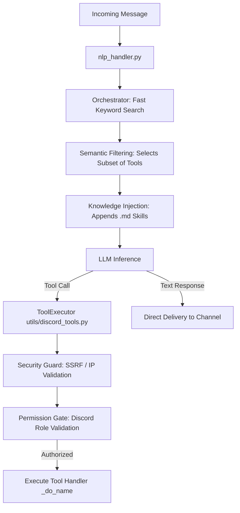

# Djinn — Autonomous Agentic Discord Bot

[](https://www.python.org/downloads/)
[](https://www.gnu.org/licenses/agpl-3.0)
[](https://github.com/astral-sh/ruff)

**Djinn** is a high-performance, autonomous agentic Discord bot built with Python. Designed for modularity, privacy, and speed, Djinn operates using a multi-model LLM decision engine with native tool-calling capabilities. It manages complex server states, handles advanced automated moderation, and seamlessly interacts with users through hundreds of registered skills.

It uses a hybrid persistence model (SQLite in WAL mode for transactional data and ChromaDB for semantic memory), trust-first automated moderation via [Goodfaith](https://github.com/goodfaith), and perceptual multimedia content analysis (MediaGuard).

---

## ✨ Core Features

*   **🧠 Agentic Decision Engine**: Routes inputs via an orchestrator to parametric language models (Google Gemini, DeepSeek, OpenRouter) with automatic circuit breakers and dynamic context windows.
*   **🛡️ Trust-First Moderation (Automod v3)**: Replaces traditional rigid rulesets with an algorithmic scoring system (`Goodfaith`), enabling reversible and graduated moderation actions with near-zero false positives.
*   **👁️ Visual Perception (MediaGuard)**: Analyzes image similarity using ONNX-based MobileNetV3 visual classification and HNSW vector indices to detect prohibited or duplicate media instantly.
*   **💾 Hybrid Database Architecture**: Employs an ultra-fast local SQLite layer in WAL mode for transactions (loans, credits, warnings) paired with ChromaDB for dense semantic retrieval (RAG).
*   **🔒 Privacy-First Design**: No data selling, zero-retention analytics. Personal profiles and simulation engines have been explicitly removed to guarantee user sovereignty.

---

## 🧠 Autonomous Skills & Multi-Action Engine

Djinn isn't just a command-response bot; it's the ultimate **right-hand administrator**. Powered by its autonomous execution engine, Djinn can dynamically chain multiple actions together from a single conversational prompt. 

### How it works:
Instead of forcing users to type multiple rigid commands (e.g., `/ban`, then `/purge`, then `/warn`), a server admin can simply say:
> *"Djinn, that user is spamming. Ban them, delete their messages from the last hour, and warn the other user who was arguing with them."*

Djinn's LLM engine parses the intent, queries its domain **Skills** (injected `.md` knowledge bases mapping out server rules, economics, and role hierarchies), and autonomously executes an array of tools:
1. `ban_user(user_id=X, delete_days=1)`
2. `warn_user(user_id=Y, reason="Arguing with spammer")`
3. `send_tts(text="Spammer neutralized.")`

By dynamically bridging **137 tools**, Djinn essentially automates the entire workflow of a dedicated human moderator, bringing unprecedented fluidity to server administration.

---

## 🛠️ Technology Stack

| Layer / Component | Technology | Purpose |
| :--- | :--- | :--- |
| **Core Language** | Python 3.11+ | Primary execution runtime |
| **API Library** | `discord.py` >= 2.4.0 | Discord Gateway client and interface |
| **LLM Client** | `google-genai` / `openai` | Universal adapter for Multi-LLM provider routing |
| **Relational Database**| `aiosqlite` >= 0.20.0 | High-concurrency transactional data & economy |
| **Vector Database** | `chromadb` >= 0.5.0 | Long-term semantic memory and vector retrieval |
| **Embedding Engine** | `sentence-transformers` | Local vector generation (`all-MiniLM-L6-v2`) |
| **Vision (MediaGuard)** | `onnxruntime` | Image classification using MobileNetV3 |
| **Vector Indexing** | `hnswlib` | Cosine-similarity approximate nearest neighbor search |
| **Ethical Moderation** | `goodfaith` | Advanced trust-first moderation framework |

---

## 🏗️ Repository Architecture

The project is structured modularly, cleanly separating presentation logic (cogs), core services (utils), and domain knowledge bases (skills):

```text
djinn/
├── main.py                    # Bootstrap, logging setup, and cog registration
├── config.py                  # Dataclass loading configuration from environment variables
├── pyproject.toml             # Configuration for pytest, ruff, and coverage
├── requirements.txt           # Strict production dependency manifest
├── start.sh                   # Startup script for UNIX environments
│
├── cogs/                      # Domain logic and Discord event handlers
│   ├── nlp_handler.py         # Message entry point: routes input to LLM
│   ├── message_logger.py      # In-memory buffering + batch database flusher
│   ├── nexus_observer.py      # Dynamic identity tracking and alias histories
│   ├── automod_v3.py          # Goodfaith-backed active moderation
│   ├── media_guard/           # MobileNetV3 visual classification + perceptual hashing
│   ├── loan_shark.py          # Debt logic, dynamic interest rates, and credit scores
│   ├── treasury.py            # Guild-wide vault and banking (/banco)
│   └── ... (30+ domain cogs)
│
├── utils/                     # Core supporting services
│   ├── discord_tools.py       # ToolExecutor: Secure inner logic for LLM capabilities
│   ├── orchestrator.py        # Keyword filtering and semantic intent routing
│   ├── llm_client.py          # Unified multi-provider LLM adapter with CircuitBreaker
│   ├── database.py            # SQLite schema, async database operations, and migrations
│   ├── security.py            # SSRF guard, command sandboxing, and permission checks
│   └── api_server.py          # Core local API on localhost:8080 (Logs, metrics, health)
│
├── skills/                    # Domain-specific Markdown files injected into system prompts
├── data/                      # Static configurations and perceptual hashes
└── tests/                     # Full automated testing suite
```

---

## 🔌 Internal API Endpoints

Djinn runs a lightweight, internal HTTP interface restricted to local connections (protected by firewall policies and Bearer tokens):

### Core API (localhost:8080)
Managed in `utils/api_server.py` and started asynchronously in the bot's `setup_hook`.
- `GET /health`: Complete service statuses, gateway latency, and `CircuitBreaker` states.
- `GET /api/v1/status`: Active cogs, version strings, and running resources.
- `GET /api/v1/metrics_x`: Token usage counters, successful/failed tool execution rates.
- `GET /api/v1/logs`: Real-time log streaming backed by an in-memory circular ring buffer.

---

## 🤖 Decision Engine & Execution Flow



### Strict Tool Contract
- JSON schemas exposed to the model are explicitly defined in `utils/tools/_declarations.py`.
- Tool execution logic is mapped to private methods in `utils/discord_tools.py` matching the naming pattern `_do_<tool_name>`.
- An automated integrity contract test (`tests/test_discord_tools_contract.py`) runs on every commit, verifying a bidirectional 1-to-1 match between model declarations and executable tool handlers.

## 🧰 Capabilities & Tool Registry (137 Tools)

Djinn exposes exactly **137 capabilities** to the LLM via its internal tool registry, allowing the agent to interact dynamically with the Discord server. These are broadly categorized into:

### 🌟 Core & Important Tools
- **Moderation & Automod:** `ban_user`, `kick_user`, `mute_user`, `mass_timeout`, `warn_user`, `antiraid_scan`, `seal_user` (Isolate users instantly).
- **Economy & Treasury (Loan Shark):** `get_user_credits`, `grant_credits`, `remove_credits`, `create_loan`, `pay_loan`, `check_guild_pool`.
- **System & Analysis:** `search_messages` (Semantic Vector RAG search), `read_audit_log`, `analyze_image` (MediaGuard), `check_domain_safety`.
- **Channel Management:** `lock_channel`, `unlock_channel`, `slowmode`, `purge_messages`.

### ⚙️ Utility & Minor Tools
- **Configuration:** `set_welcome_channel`, `set_automod_status`, `set_tts_role`.
- **Roles & Identity:** `add_role`, `remove_role`, `rename_user`, `get_avatar`.
- **Fun & Social:** `send_tts`, `curse_user`, `mouthwash_user`, `create_poll`.
- **Internal APIs:** `get_metrics`, `read_logs`, `override_channel`.

---

## ⚙️ Configuration & Quick Start

### Environment Variables (.env)
```ini
# Discord Gateway
DISCORD_TOKEN=your_discord_token

# LLM Provider
LLM_PROVIDER=custom               # Options: google, openrouter, custom
CUSTOM_BASE_URL=http://localhost:8090/v1
CUSTOM_API_KEY=your_api_key
CUSTOM_MODEL_NAME=gemini-3.5-flash-low

# APIs
GOOGLE_API_KEY=your_api_key

# Internal Config
DB_PATH=db/fairy.db
FAIRY_API_PORT=8080
```

### Starting the Bot
Djinn implements an automated virtual environment bootstrap system:
```bash
# Make start script executable and run
chmod +x start.sh
./start.sh
```
The `start.sh` script initializes a fresh virtual environment, installs packages from `requirements.txt`, and automatically runs the process.

---

## 🧪 Testing Suite

The codebase has a comprehensive async testing suite containing over **370 test cases**. Run it using:
```bash
./venv/bin/pytest tests/ -v
```

### Key Subsystems Audited:
- `tests/test_discord_tools_contract.py`: Audits the bidirectional integrity of tools.
- `tests/test_goodfaith_engine.py`: Validates trust-based automod thresholds.
- `tests/test_security.py`: Ensures absolute protection against SSRF and validates permissions.
- `tests/test_circuit_breaker.py`: Exercises LLM client failovers.
- `tests/test_database_*.py`: Validates transactional atomicity for guild finances.

---

## ⚖️ License & Copyright

Djinn is open-source software licensed under the **GNU Affero General Public License version 3 (AGPL-3.0)**. Refer to the [LICENSE](LICENSE) file for the full legal text.

Copyright (C) 2026 @ArisRhiannon.
