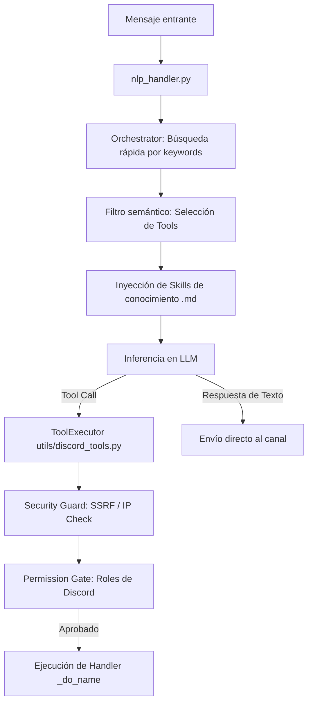

# Djinn — Discord Agentic Bot

Djinn es un bot agéntico para Discord inspirado en el concepto de IA de *Zenless Zone Zero*. Funciona sobre un motor de toma de decisiones multi-modelo con soporte nativo para tool calling que interactúa directamente sobre el servidor mediante 137 herramientas registradas.

El sistema implementa persistencia híbrida (SQLite en modo WAL + ChromaDB para memoria semántica), moderación automatizada basada en contratos de confianza (Goodfaith), análisis perceptual de contenido multimedia (MediaGuard), APIs HTTP internas de administración y un subsistema de rol narrativo estructurado (Kadath).

---

## 🛠️ Stack Tecnológico

| Capa / Componente | Tecnología | Propósito |
| :--- | :--- | :--- |
| **Lenguaje Core** | Python 3.11 | Motor de ejecución principal |
| **Biblioteca API** | discord.py >= 2.4.0 | Cliente y pasarela de Discord (Gateway) |
| **Cliente LLM** | google-genai >= 1.0.0 | SDK activo para Gemini y modelos paramétricos Gemma |
| **APIs Alternativas** | openai >= 1.40.0 | Soporte para OpenRouter, DeepSeek v4 y NimLLM |
| **Base de Datos Relacional** | aiosqlite >= 0.20.0 | Persistencia de datos transaccionales, créditos, colas y logs |
| **Base de Datos Vectorial** | chromadb >= 0.5.0 | Memoria asíncrona a largo plazo y recuperación semántica |
| **Motor de Embeddings** | sentence-transformers >= 3.3.0 | Generación local de vectores (`all-MiniLM-L6-v2`) |
| **Traducción MarianMT** | sentencepiece + sacremoses | Pipeline local para el cog de traducción curse_translator |
| **Visión (MediaGuard)** | onnxruntime >= 1.16.0 | Clasificación de imágenes (MobileNetV3) |
| **Indexación Vectorial Media**| hnswlib >= 0.8.0 | Búsqueda aproximada por coseno para evitar duplicados en disco |
| **Generación Gráfica** | cairosvg + Pillow | Renderizado dinámico de SVG a PNG y ensamblado de GIFs |
| **TTS (Voz)** | Piper | Motor externo de síntesis de voz offline |
| **Audio** | PyNaCl + mafic >= 2.11.0 | Protocolo de voz y cliente para servidores Lavalink |
| **Confianza Automod** | goodfaith >= 0.6.0 | Biblioteca externa de toma de decisiones éticas y mitigación |

---

## 🏗️ Estructura del Repositorio

El proyecto se organiza de manera modular separando la lógica de presentación (cogs), la infraestructura de ejecución (utils) y las bases de conocimiento (skills):

```
djinn/
├── main.py                    # Inicialización global, setup del logger y carga de cogs
├── config.py                  # Dataclass de configuración cargada directamente del entorno
├── pyproject.toml             # Configuración de pytest, ruff y cobertura
├── requirements.txt           # Manifiesto estricto de dependencias de producción
├── start.sh                   # Script de inicio en entornos UNIX
│
├── cogs/                      # Lógica de dominio y handlers de Discord
│   ├── nlp_handler.py         # Punto de entrada de mensajes: despachador al LLM
│   ├── message_logger.py      # Persistencia en memoria + flush por lotes a la DB
│   ├── nexus_observer.py      # Tracking dinámico de identidades e históricos de alias
│   ├── automod_v3.py          # Moderación activa vía Goodfaith (Wave 9)
│   ├── media_guard/           # Clasificación visual + hash perceptual con MobileNetV3
│   ├── dream_quest.py         # Máquina de estados narrativos del juego Kadath
│   ├── loan_shark.py          # Lógica crediticia, tasas de interés y control de deudas
│   ├── treasury.py            # Banco del servidor (/banco)
│   ├── override_api.py        # API interna para control remoto (Puerto 7700)
│   └── ... (38 cogs en total)
│
├── utils/                     # Componentes core del sistema
│   ├── discord_tools.py       # ToolExecutor: Lógica interna para las 137 herramientas
│   ├── tools/
│   │   ├── _declarations.py   # Declaraciones JSON de herramientas para el LLM
│   │   ├── _helpers.py        # Validadores matemáticos y parsers de fechas
│   │   └── _constants.py      # Configuración de seguridad y formateadores JSON
│   ├── orchestrator.py        # Filtro semántico de keywords y enrutado de intenciones
│   ├── llm_client.py          # Adaptador unificado multi-proveedor con CircuitBreaker
│   ├── database.py            # Esquema SQLite, migraciones y primitivas asíncronas
│   ├── security.py            # SSRF guard, sandbox de comandos y permission map
│   └── api_server.py          # API interna en localhost:8080 (Logs, métricas, health)
│
├── skills/                    # Conocimientos en Markdown inyectados bajo demanda
│   ├── deudas.md              # Lógica del cobrador de préstamos
│   ├── banco.md               # Mecánica bancaria de depósitos y pools
│   └── ... (16 archivos de conocimiento)
│
├── data/                      # Configuración estática y hashes perceptuales
│   ├── safe_domains.json      # Cache local de 10k dominios seguros para anti-phishing
│   └── banned_media.bin       # Índice vectorial HNSW de imágenes prohibidas
│
├── db/                        # Directorio para archivos SQLite (gitignored)
├── logs/                      # Históricos de logs con rotación integrada (gitignored)
└── tests/                     # Suite completa de pruebas automatizadas
```

---

## 🗃️ Esquema de Persistencia (SQLite)

La base de datos relacional opera bajo las siguientes configuraciones de rendimiento optimizadas en `utils/database.py`:
- `PRAGMA journal_mode = WAL`
- `PRAGMA synchronous = NORMAL`
- `PRAGMA busy_timeout = 5000`

### Tablas Principales

#### 1. `message_logs` (Histórico de mensajes para búsqueda contextual)
- **Campos:** `id` (INTEGER, PK), `message_id` (TEXT, UNIQUE), `author_id` (TEXT), `author_name` (TEXT), `content` (TEXT), `channel_id` (TEXT), `guild_id` (TEXT), `created_at` (TIMESTAMP), `embedding_vector` (BLOB)
- **Optimización:** Virtual table adjunta FTS5 sobre el campo `content` para búsquedas en texto plano instantáneas.

#### 2. `user_credits` (Economía del bot)
- **Campos:** `user_id` (TEXT, PK), `credits` (INTEGER), `updated_at` (TIMESTAMP)

#### 3. `loans` (Préstamos individuales)
- **Campos:** `id` (INTEGER, PK), `user_id` (TEXT), `guild_id` (TEXT), `amount` (INTEGER), `interest_rate` (REAL), `due_date` (TIMESTAMP), `missed_payments` (INTEGER), `status` (TEXT: "active", "paid", "defaulted")

#### 4. `server_vault` (Tesorería del servidor)
- **Campos:** `guild_id` (TEXT, PK), `pool_amount` (INTEGER), `last_updated` (TIMESTAMP)

#### 5. `identity_associations` (Grafo de Alias / Nexus)
- **Campos:** `alias` (TEXT), `entity_id` (TEXT), `entity_type` (TEXT), `guild_id` (TEXT), `last_seen` (TIMESTAMP)
- **Restricción:** Unique index sobre `(alias, entity_id, guild_id)`.

---

## 🔌 APIs Internas

Djinn arranca dos interfaces HTTP internas de uso exclusivo local (seguridad por firewall local y tokens Bearer):

### 1. API Core (localhost:8080)
Administrada en `utils/api_server.py` e iniciada de manera asíncrona en el `setup_hook` del bot.
- `GET /health`: Estado detallado de servicios, latencia del Gateway, y estado del `CircuitBreaker`.
- `GET /api/v1/status`: Cogs cargados, versión del SDK y métricas del sistema.
- `GET /api/v1/metrics_x`: Contadores de tokens consumidos, ejecuciones de herramientas con éxito/fallo y latencias.
- `GET /api/v1/logs`: Streaming en tiempo real de logs del sistema mediante buffer circular.

### 2. API de Control Remoto (localhost:7700)
Definida en `cogs/override_api.py`. Permite interactuar con canales, forzar reportes diarios, leer buffers históricos y disparar llamadas de herramientas externas. Protegido por firma de cabecera `Authorization: Bearer <token>`.
El puerto se puede cambiar dinámicamente mediante la variable de entorno `FAIRY_OVERRIDE_API_PORT`.

---

## 🤖 Mecánica de Ejecución (Tool Calling y Ruteo)



### Contrato de Herramientas Estricto
- Las declaraciones JSON que el LLM consume se definen de forma explícita en `utils/tools/_declarations.py`.
- La lógica interna de las mismas se define en `utils/discord_tools.py` mediante métodos `_do_<nombre_herramienta>`.
- Existe un test de contrato de integridad (`tests/test_discord_tools_contract.py`) que audita en cada commit que haya una correspondencia bidireccional perfecta e idéntica de 1 a 1 entre declaraciones y métodos ejecutores.

---

## ⚙️ Configuración y Arranque

### Variables de Entorno (.env)
```ini
# Configuración de Discord
DISCORD_TOKEN=tu_discord_token

# Motor de Inferencia
LLM_PROVIDER=custom               # Opciones: google, openrouter, custom
CUSTOM_BASE_URL=http://localhost:8090/v1
CUSTOM_API_KEY=tu_api_key
CUSTOM_MODEL_NAME=gemini-3.5-flash-low

# APIs Adicionales
GOOGLE_API_KEY=tu_api_key
OPENROUTER_API_KEY=tu_api_key

# Rutas de Persistencia
DB_PATH=db/fairy.db
RESPONSES_PATH=data/fairy_responses.json

# Puertos Internos
FAIRY_API_PORT=8080
FAIRY_OVERRIDE_API_PORT=7700
```

### Inicio del Sistema
El bot implementa un mecanismo de bootstrap automático:
```bash
# Otorgar permisos e iniciar
chmod +x start.sh
./start.sh
```
El script `start.sh` buscará el entorno virtual local `venv`. Si no existe, se disparará `main.py:_bootstrap_venv` la cual creará el venv, instalará todas las dependencias listadas en `requirements.txt` y se auto-ejecutará dentro del venv asilado.

---

## 🧪 Pruebas Automatizadas

La suite de pruebas contiene **375 pruebas integrales** ejecutándose de manera asíncrona.

```bash
# Ejecutar todas las pruebas locales
./venv/bin/pytest tests/ -v
```

### Cobertura de las suites principales:
- `tests/test_discord_tools_contract.py`: Audita la coincidencia total del contrato de las 137 herramientas.
- `tests/test_goodfaith_engine.py`: Valida el motor ético de automod y toma de decisiones basadas en reputación de usuarios.
- `tests/test_security.py`: Valida el detector de SSRF, el bloqueo de IPs y rangos privados en herramientas web.
- `tests/test_circuit_breaker.py`: Comprueba el comportamiento del Circuit Breaker ante fallos repetitivos del proveedor LLM externo.
- `tests/test_database_shares.py` y `tests/test_database_credits.py`: Comprueban la consistencia y transaccionalidad de las bases de datos de créditos y préstamos.

---

## ⚖️ Licencia y Copyright

El código fuente de Djinn está protegido bajo la licencia **GNU Affero General Public License versión 3 (AGPL-3.0)**. Puedes consultar el archivo [LICENSE](LICENSE) para ver el texto completo.

Copyright (C) 2026 @ArisRhiannon.
